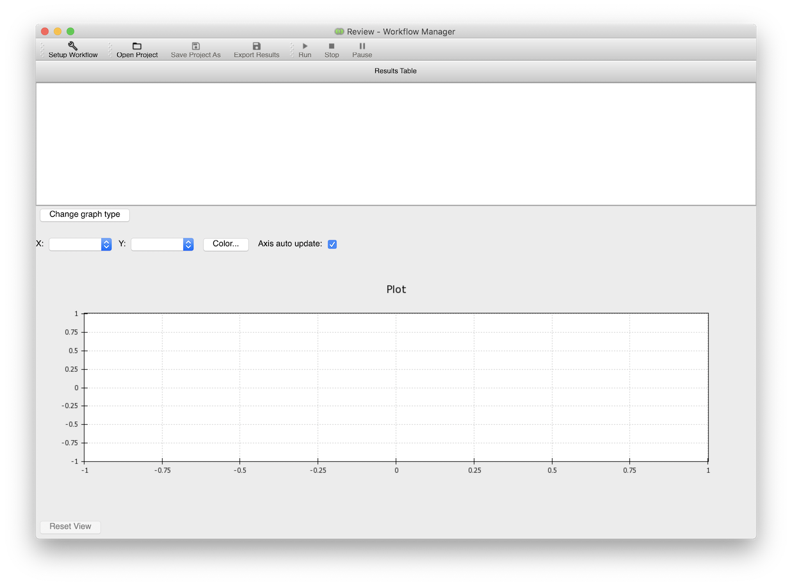
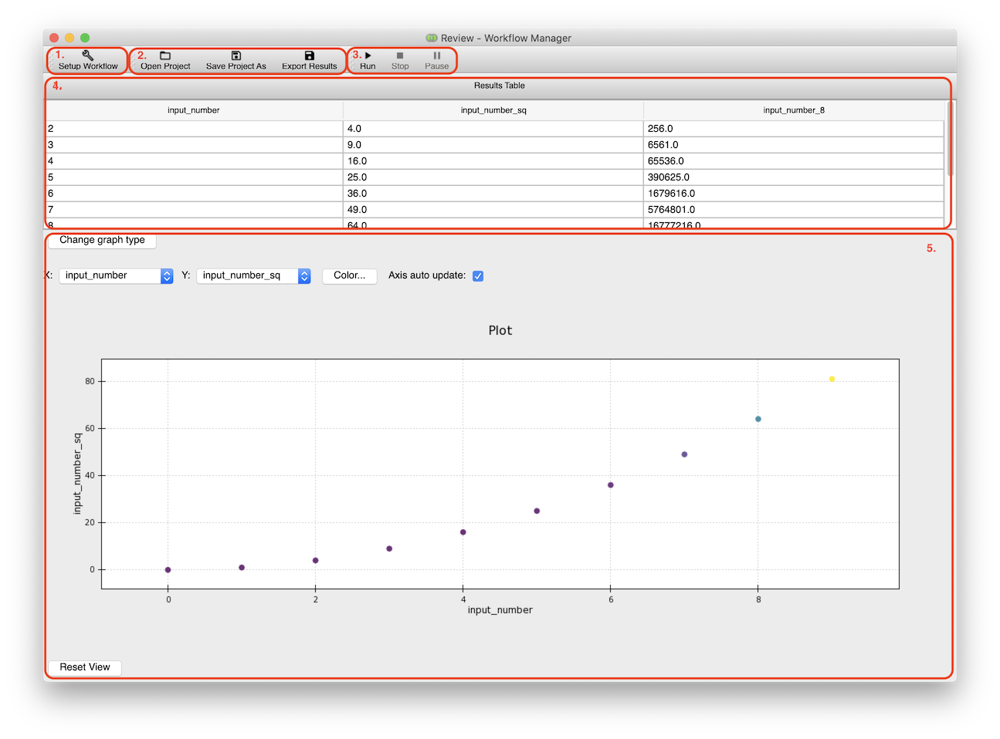

WfManager GUI Design
--------------------

The FORCE WfManager is built on top of the `Envisage <https://docs.enthought.com/envisage/index.html>`_ framework
for extensible GUI applications. As such, at the heart of the application is the ``WfManager`` class, which inherits
from ``envisage.TaskApplication``. The current design of the FORCE WfManager contains two ``pyface.Task``
implementations: the ``WfManagerSetupTask`` and ``WfManagerReviewTask`` classes. These objects provide the functionality
to construct workflows and analyse the results of an MCO respectively. Switching between tasks is performed by using
the "Setup" and "Review" toolbar icons.

Setup Task
~~~~~~~~~~

The Setup task is used to construct workflows to optimise in the BDSS. As well as providing UI features to edit model
parameters related to each component in the workflow (data sources, notification listeners, MCO etc.) it also allows
the user to define how variables are passed between input and output slots between execution layers.

.. list-table::

    * - Number
      - Description
    * - 1. View Results
      - Review task icon, switches view to the Review task
    * - 2. Workflow IO
      - Shortcut icons for opening / closing Workflow files
    * - 3. Plugins info
      - Brings up plugins window, including a description of each BDSS plugin
        detected
    * - 4. Custom UI window
      - Brings up custom UI selection window, used to start
    * - 5. MCO control
      - Start / stop / pause controls for the MCO
    * - 6. Workflow tree
      - Tree selection panel for parts of the Workflow under construction
    * - 7. Workflow editor
      - View used to edit selected parts of the Workflow under construction
    * - 8. Workflow Errors
      - Displays errors reported by verification routine of Workflow under construction

Review Task
~~~~~~~~~~~

The Review task is used both display the results and progess of the MCO being performed on a constructed
workflow. It contains a table of values that are reported back to the WfManager during an optimization
proceedure, as well as a selection of 2D plots to view these values.

.. list-table::

    * - Number
      - Description
    * - 1. Setup Workflow
      - Setup task icon, switches view to the Setup task
    * - 2. Project IO
      - Shortcut icons for opening / closing Project files
    * - 3. MCO control
      - Start / stop / pause controls for the MCO
    * - 4. MCO results table
      - Table displaying data reported back from an MCO, with each row representing an optimal point identified
    * - 5. MCO results plot
      - Plot displaying data reported back from an MCO